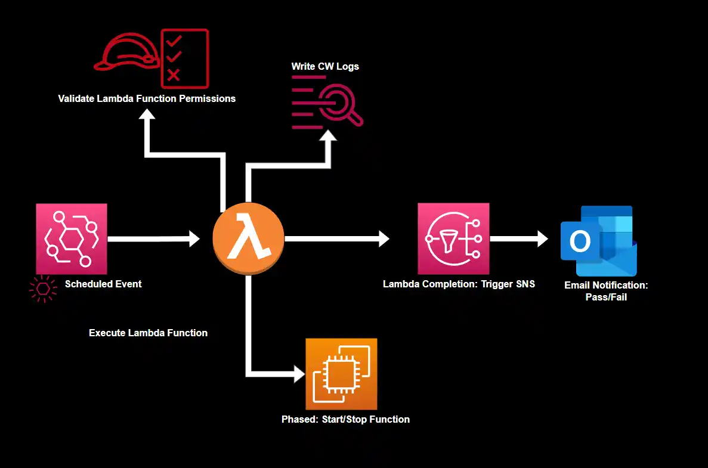

# AWS EC2 Start/Stop Automation

**Lambda scripts for automated ec2 start and stop functions**

## Table of Contents

- [AWS Login]()
- [**Initial Configurations**](how_to/initial_config.md)

     
