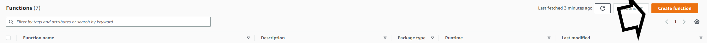

# AWS-Start-Stop-Automation
 Lambda scripts for automated ec2 start and stop functions
 
 ## Login to AWS Console:
 
 ### Configuring IAM Role and Policy for Lambda Function
 
 1. Select the Identity and Access Management (IAM) Service
 2. Under Access Management > Select **Policies**
 
 3. Select **Create Policy**
 4. Within the Visual Editor, Select the **Choose a service**
 5.  Search **Lambda**
 6. Under the **Actions** Pane, Expand **Write** and Select &#x2611;**InvokeFunction**
 7. Under **Resources** Pane, Select the &#x2611; **Any in this account**
 
 > **__NOTE:__** This will be modified later for fine-grained permissions
 
 8. Select **Next: Tags**
 9. Add a tag if you would like
 10. Select **Next:Review**
 
 ### Configuring Lambda Functions

 1. Login to AWS Console
 2. In the Search bar, type Lambda and Select the Lambda service
 3. Select "Create Function"
 
 4. 

