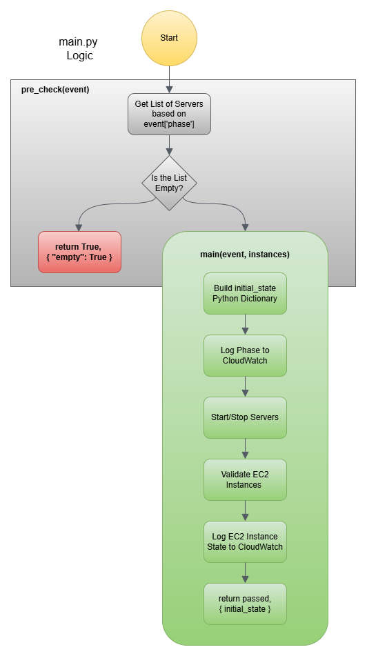

# Lambda Function: Start_Stop
### 📁Folder Structure
```tree
root/
├── lambda_function.py
├── SERVER_LIST.py
└── start_stop/
  ├── __init__.py
  ├── main.py
  └── aws/
    ├── __init__.py
    ├── ec2_handler.py
    ├── sns_handler.py
    └── cloudwatch/
      ├── __init__.py
      ├── alarm_handler.py
      └── log_handler.py
```

## AWS Lambda Workflow Handler 
```python
python

from start_stop.main import pre_check
from start_stop.aws.sns_handler import SNSHandler


def lambda_handler(event, context):
    if event['send_mail']:
        sns = SNSHandler(event)
        sns.send_mail()
        return {
            'statusCode': 200
        }
    elif event['next_phase']:
        next_phase, initial_state = pre_check(event)
        return {
            'statusCode': 200,
            'next_phase': next_phase,
            'initial_state': initial_state
        }
    return {
        'statusCode': 200,
        'next_phase': event['next_phase']
    }
```

This AWS Lambda function directs two primary workflows based on the event payload:

**📧 Email Notification**  
   If `event['send_mail']` is `true`, initializes `SNSHandler(event)`
  - triggers `sns.send_mail()`
  - returning a `200` status.

**🔁 Initiating Pre-Checks for event['action']**  
   If `event['next_phase']` is `true`, it initiates `pre_check(event)`
   - `next_phase`: boolean value used for Step Function processing
   - `initial_state`: the initial state of the EC2 instances list 
   - Returns both along with status `200`.

**⏹️ Default**  
   If neither flag is set, simply echoes back `event['next_phase']` with status `200`.

---
# 🚦 EC2 Phase-Based Orchestration with CloudWatch Integration



---

##  Core Workflow
```python
python

from SERVER_LIST import server_lists
from start_stop.aws.ec2_handler import EC2Instance


def pre_check(event):
    instances = EC2Instance(server_lists()[event['phase_number']])
    if len(instances.names) > 0:
        return main(event, instances)
    return True, {"empty": True}
    
def main(event, instances):
    initial_state = instances.describe()
    print(event['cw_log_phase'].upper())
    instances.start_or_stop(event['action'])
    passed = get_validation_state(instances, event['action'])
    instances.instance_log_status(passed, event['action'])
    return passed, initial_state

def get_validation_state(instances, action):
        if action == 'start':
            return instances.validate_status(0, action)
        else:
            return instances.validation(0, action)
```


### Phase selector (`pre_check`)

- Picks the server list from `server_lists()` using `event['phase_number']` as an index pointer.
- If the list is empty, returns `(True, {"empty": True})`, skipping actions.
- Otherwise, proceeds to `main()` for further processing.

### Action executor (`main`)

- Captures current state with `instances.describe()`.
- Logs the CloudWatch phase (`event['cw_log_phase']`).
- Starts or stops instances using `instances.start_or_stop(event['action'])`.
- Validates status via `get_validation_state()`.
- Logs final result through `instances.instance_log_status(...)`.
- Returns `(passed, initial_state)`.

### Validation logic (`get_validation_state`)

- Uses `validate_status()` for **“start”** actions to include system-level checks.
- Uses `validation()` to poll basic instance states.

---

## 🔧 EC2Instance Helper Class

- `describe()`: Builds a name → metadata map (ID/state/running flag).
- `start_or_stop()`: Decides to start or stop based on the requested action.

#### Example Dictionary from `describe()`
```
json
{
  "test1": {
    "InstanceId": ""i-0bad14933fffa49b9",
    "State": "running",
    "is_running": True
  }
}
```

**Start path:**

- Logs per-instance state.
- Initiates start calls for stopped instances.
- Enables CloudWatch alarms via `AlarmManager`.

**Stop path:**

- Logs current states.
- Disables CloudWatch alarms via `AlarmManager`.
- Stops running instances.

**Validation methods (`validation`, `validate_status`):**

- Poll EC2 status until desired state or retry capped.
- `validate_status` adds deeper CloudWatch Instance/System checks.

**Logging** via `Logger`, which generates descriptions of actions, validation progress, aborts, and final statuses.

`get_end_state()`: Static method to snapshot all phases for reporting.

---

## 🔔 CloudWatch Alarm Management (`AlarmManager`)

- `disable_alarms()` / `enable_alarms()`:
  - Scans CloudWatch alarms matching instance names.
  - Toggles alarm actions accordingly—ensuring that alarms aren't firing during planned operations.

---
