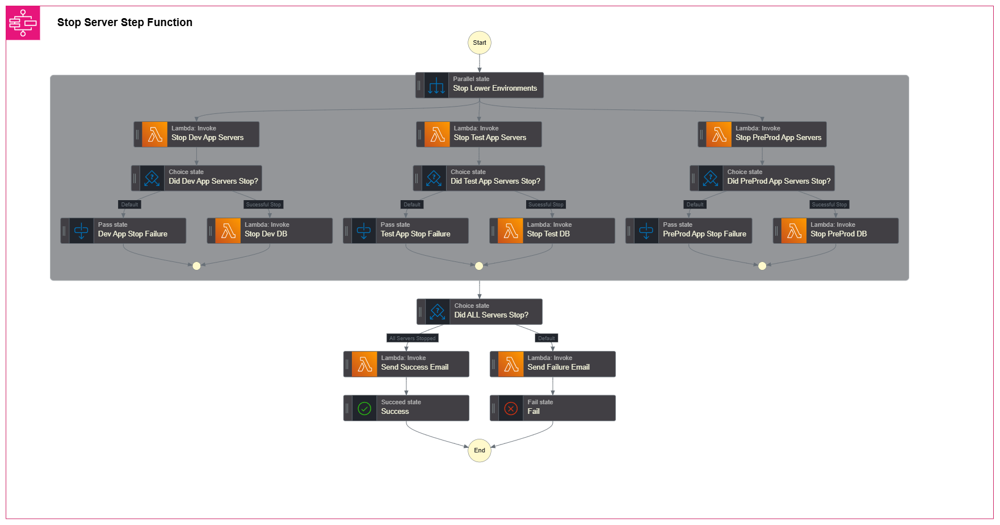

# Step Function States

For more information for JSON Payload information for each state, check it out [here](./JSON_payload.md)

For more information on the underlying Lambda Function, check it out [here](./start_stop.md)

- [Go to Stop Steps](#stop)

## Start


---
### Initial Parallel States
- Development DB Servers
- Test DB Servers
- Pre-Production DB Servers
---
- To start the process, each Lambda function state within the parallel state is given input information that the Lambda Handler expects as event data.
   As seen below:
   - **phase_number** - The index of the server list within start_stop.py
   - **next_phase** - The boolean value (true/false) whether to execute the main function
   - **action** - Either "start" or "stop". Corresponds to the Lambda function logic to either execute the Boto3 method ***start_instances*** or ***stop_instances*** for EC2 instances
   - **cw_log_phase** - Used for posting to CloudWatch to show what execution step is being accomplished
   - **send_mail** - The boolean value whether to send the email notification to Sys Admins 
  
```
Example JSON Payload Input:

{
"phase_number": 3,
"next_phase": true,
"action": "start",
"cw_log_phase": "starting development db servers",
"send_mail": false
}
```
    
  - Upon completion of the Lambda functions, they return JSON data back to the Step Function to assist with next step logic
    - **next_phase** - The boolean value (true/false) whether to proceed starting the corresponding application servers
    - **initial_state** - The initial state is the processed description of each EC2 within a given server list. This uses the Boto3 method ***describe_instances*** for EC2 instances
    
 ```
 Example Output From Lambda:
 
  {
    "next_phase": true,
    "initial_state": {
      "test10": {
      "InstanceId": "i-0bad14933fffa49b9",
      "State": "stopped",
      "is_running": false
      },
      "test3": {
      "InstanceId": "i-079d3e78afa290053",
      "State": "stopped",
      "is_running": false
      },
      "test9": {
      "InstanceId": "i-082e1ef64192e11ad",
      "State": "stopped",
      "is_running": false
      }
    }
  }
  ```
---
### Choice
- The next step in the process is to determine whether or not to proceed starting application servers within its parallel state
   - Utilizing the **next_phase** output from the previous Lambda Function, the ***Choice*** state will use the following logic:
     - IF **$states.input.next_phase == true**, proceed to start the application servers
     - DEFAULT is to pass the output data if **$states.input.next_phase != true**, and do not start the next phase
   
---    
### **$states.input.next_phase == true**
- If **$states.input.next_phase == true**, the state machine will proceed to the next state
   - For my implentation, I designated a wait period of 10 mins to ensure Database services are started before application servers are brought online
   
---
### DEFAULT ($states.input.next_phase != true)
- The default path for ***Choice*** is not to enter the Wait period state and start the application servers
   - This was established to ensure if there were any bugs with the Lambda function, the state machine will not start the next phase and proceed to the end
   - **"dev_db_initial_state"** - the passed initial state information provided by the starting Lambda function
   - **"dev_app_initial_state"** - this has the value **"empty": true** because the DEV App server starts will not be executed, but the final stage requires that variable to function properly

```
Example of the DEV DB function passing "next_phase" == false

{
"dev_db_initial_state": "",
"dev_app_initial_state": { "empty": true }
}

```
---
### Start Application Servers
- After the designated 💤 wait time has been met, the Lambda function to start the application servers will execute
   - This will be similar to the initial database starts, where the Lambda function expects a JSON payload
   - The big difference here will be the **next_phase** information will be the output from the previous Lambda function **"next_phase": "next_phase.$"**
   - See example below for DEV APP Servers
   ```
   {
     "phase_number": 0,
     "next_phase": "next_phase.$",
     "action": "start",
     "cw_log_phase": "starting development app servers",
     "send_mail": false
   }
   ```
- The Final stage of the parallel state is consolidating the output information from the inital Lambda functions and the from the final function
  - This information will be used as input information for the email notification
  - **"start_dev"** - Passes the boolean variable (true/false) if the execution was successful. This will be used in the next ***Choice*** state to determine success or failure
  - **"dev_server_type"** - This value is also used in the ***Choice** logic to ensure proper success
  - **"dev_db_initial_state"** - The initial state of the Dev DB servers before start execution passed from Step 1
  - **"dev_app_initial_state"** - The initial state of the Dev App servers before the start execution of the recent Lambda execution
  ```
  {
     "start_dev": "",
     "dev_server_type": "application",
     "dev_db_initial_state": "",
     "dev_app_initial_state": ""
   }
  ```
  ```
  Example Output from the given variables

  {
     "start_dev": true,
     "dev_server_type": "application",
     "dev_db_initial_state": {
       "test2": {
         "InstanceId": "i-0a062c05709e20ad0",
         "State": "stopped",
         "is_running": false
       },
       "test7": {
         "InstanceId": "i-04a73868ebee75b2a",
         "State": "stopped",
         "is_running": false
       },
       "test8": {
         "InstanceId": "i-0adc7101a10fd2fe8",
         "State": "stopped",
         "is_running": false
       }
     },
     "dev_app_initial_state": {
       "test1": {
         "InstanceId": "i-037d7784a77c355e5",
         "State": "stopped",
         "is_running": false
       },
       "test19": {
         "InstanceId": "i-08d7a9d4de6d32648",
         "State": "stopped",
         "is_running": false
       },
       "test4": {
         "InstanceId": "i-08c6921d3e8b05c11",
         "State": "stopped",
         "is_running": false
       },
       "test5": {
         "InstanceId": "i-022ce6c6a0d6457e2",
         "State": "stopped",
         "is_running": false
       }
     }
   }
   ```

---
### Final Choice
- This step is used to determine if the execution was successful or a failure
- This can be used to provide insight to the SysAdmin team if intervention is required for failure
- For the workflow to be determined a success, the following conditions must be met:
  - **"start_dev" AND "start_test" AND "start_preprod" == true**
  - **AND**
  - **"dev_server_type" AND "test_server_type" AND "preprod_server_type" == "application"**

---
### Send Email
- The Final step of the state machine
- 笘托ｸ終f all the **Final Choice** conditions are met, the email subject will be **START STATUS: SUCCESS**
- 笨厄ｸ終f the values do not meet the requirement, the email subject will be **START STATUS: ABORTED**

See Example [Email Here 📧](./sns.md)

---
## Stop


---
### Initial Parallel States
- Development App Servers
- Test App Servers
- Pre-Production App Servers
---
- To start the process, each Lambda function state within the parallel state is given input information that the Lambda Handler expects as event data.
   As seen below:
   - **phase_number** - The index of the server list within start_stop.py
   - **next_phase** - The boolean value (true/false) whether to execute the main function
   - **action** - Either "start" or "stop". Corresponds to the Lambda function logic to either execute the Boto3 method ***start_instances*** or ***stop_instances*** for EC2 instances
   - **cw_log_phase** - Used for posting to CloudWatch to show what execution step is being accomplished
   - **send_mail** - The boolean value whether to send the email notification to Sys Admins 
  
```
Example JSON Payload Input:

{
"phase_number": 0,
"next_phase": true,
"action": "stop",
"cw_log_phase": "stopping development app servers",
"send_mail": false
}
```
    
  - Upon completion of the Lambda functions, they return JSON data back to the Step Function to assist with next step logic
    - **next_phase** - The boolean value (true/false) whether to proceed starting the corresponding application servers
    - **initial_state** - The initial state is the processed description of each EC2 within a given server list. This uses the Boto3 method ***describe_instances*** for EC2 instances
    
 ```
 Example Output From Lambda:
 
  {
    "next_phase": true,
    "initial_state": {
      "test10": {
      "InstanceId": "i-0bad14933fffa49b9",
      "State": "running",
      "is_running": true
      },
      "test3": {
      "InstanceId": "i-079d3e78afa290053",
      "State": "running",
      "is_running": true
      },
      "test9": {
      "InstanceId": "i-082e1ef64192e11ad",
      "State": "running",
      "is_running": true
      }
    }
  }
  ```
---
### Choice
- The next step in the process is to determine whether or not to proceed stopping database servers within its parallel state
   - Utilizing the **next_phase** output from the previous Lambda Function, the ***Choice*** state will use the following logic:
     - IF **$states.input.next_phase == true**, proceed to stop the database servers
     - DEFAULT is to pass the output data if **$states.input.next_phase != true**, and do not start the next phase
   
---    
### **$states.input.next_phase == true**
- If **$states.input.next_phase == true**, the state machine will proceed to the next state and stop the database servers
   
---
### DEFAULT ($states.input.next_phase != true)
- The default path for ***Choice*** is not to start the database servers
   - This was established to ensure if there were any bugs with the Lambda function, the state machine will not start the next phase and proceed to the end
   - **"dev_app_initial_state"** - the passed initial state information provided by the starting Lambda function
   - **"dev_db_initial_state"** - this has the value **"empty": true** because the DEV App server starts will not be executed, but the final stage requires that variable to function properly

```
Example of the DEV App function passing "next_phase" == false

{
"dev_app_initial_state": "",
"dev_db_initial_state": { "empty": true }
}

```
---
### Stopping Database Servers
- After the meeting the ***Choice*** requirements the Lambda function to stop the database servers will execute
   - This will be similar to the initial application stops, where the Lambda function expects a JSON payload
   - The big difference here will be the **next_phase** information will be the output from the previous Lambda function **"next_phase": "next_phase.$"**
   - See example below for DEV DB Servers
   ```
   {
     "phase_number": 3,
     "next_phase": "next_phase.$",
     "action": "stop",
     "cw_log_phase": "stopping development db servers",
     "send_mail": false
   }
   ```
- The Final stage of the parallel state is consolidating the output information from the inital Lambda functions and the from the final function
  - This information will be used as input information for the email notification
  - **"stop_dev"** - Passes the boolean variable (true/false) if the execution was successful. This will be used in the next ***Choice*** state to determine success or failure
  - **"dev_server_type"** - This value is also used in the ***Choice** logic to ensure proper success
  - **"dev_app_initial_state"** - The initial state of the Dev App servers before start execution passed from Step 1
  - **"dev_db_initial_state"** - The initial state of the Dev DB servers before the start execution of the recent Lambda execution
  ```
  {
     "stop_dev": "",
     "dev_server_type": "database",
     "dev_app_initial_state": "",
     "dev_db_initial_state": ""
   }
  ```
  ```
  Example Output from the given variables

  {
     "stop_dev": true,
     "dev_server_type": "database",
     "dev_app_initial_state": {
       "test1": {
         "InstanceId": "i-037d7784a77c355e5",
         "State": "running",
         "is_running": true
       },
       "test19": {
         "InstanceId": "i-08d7a9d4de6d32648",
         "State": "running",
         "is_running": true
       },
       "test4": {
         "InstanceId": "i-08c6921d3e8b05c11",
         "State": "running",
         "is_running": true
       },
       "test5": {
         "InstanceId": "i-022ce6c6a0d6457e2",
         "State": "running",
         "is_running": true
       },
     "dev_db_initial_state": {
       "test2": {
         "InstanceId": "i-0a062c05709e20ad0",
         "State": "running",
         "is_running": true
       },
       "test7": {
         "InstanceId": "i-04a73868ebee75b2a",
         "State": "running",
         "is_running": true
       },
       "test8": {
         "InstanceId": "i-0adc7101a10fd2fe8",
         "State": "running",
         "is_running": true
       }
     }     
     }
   }
   ```

---
### Final Choice
- This step is used to determine if the execution was successful or a failure
- This can be used to provide insight to the SysAdmin team if intervention is required for failure
- For the workflow to be determined a success, the following conditions must be met:
  - **"stop_dev" AND "stop_test" AND "stop_preprod" == true**
  - **AND**
  - **"dev_server_type" AND "test_server_type" AND "preprod_server_type" == "database"**

---
### Send Email
- The Final step of the state machine
- 笘托ｸ終f all the **Final Choice** conditions are met, the email subject will be **START STATUS: SUCCESS**
- 笨厄ｸ終f the values do not meet the requirement, the email subject will be **START STATUS: ABORTED**

See Example [Email Here 📧](./sns.md)


